---

layout: default
title: "Élodie HEINRY | DATA Analyst"
description: "Nouvelle direction, Même détermination !"

---

<!-- En-tête avec photo -->

<header class="text-center mb-2">
  
</header>

<!-- Accroche -->

<section class="text-center mb-3" style="line-height: 1.6;">
  <h2 style="color: var(--secondary);">De la Reconversion à la Révélation : Mon Pari Gagnant</h2>
</section>

<!-- Icônes de contact -->

<nav class="text-center mt-2">
  <!-- Email -->
  
  <!-- LinkedIn -->
  
  <!-- GitHub -->
  
  <!-- CV -->
  
  <!-- Localisation -->
   
  <strong>Disponible pour un CDI/CDD sur Montpellier et alentours</strong>
</nav> 

<!-- Navigation rapide -->

<nav class="text-center mb-2" aria-label="Navigation principale">
  <a href="#apropos" class="nav-btn">À Propos</a>
  <a href="#competences" class="nav-btn">Compétences</a>
  <a href="#projets" class="nav-btn">Projets</a>
  <a href="#formations" class="nav-btn">Formations</a>
  <a href="#experiences" class="nav-btn">Expériences</a>
  <a href="#contact" class="nav-btn">Contact</a>
</nav>

<!--séparation-->

<!-- À propos -->

<section id="apropos" class="container mb-3">
  <header class="text-center">
    <h1><strong>👋 À Propos de moi</strong></h1>
  </header> 

<article style="text-align:justify; margin-left: 3rem; margin-right: 3rem; display: inline-block;">
    

      Data Analyst orientée <strong>décisionnel</strong>, avec une formation solide en <strong>BI (Power BI, DAX, SQL)</strong> et en <strong>analyses avancées sous Python</strong>. J’aime transformer des données brutes en <strong>outils opérationnels, insights actionnables et recommandations stratégiques</strong>. 

    

      Mon parcours scientifique m’apporte une <strong>méthodologie rigoureuse</strong>, un <strong>raisonnement structuré</strong> et une <strong>maîtrise de l’expérimentation</strong>. Je conçois des <strong>dashboards fiables, modèles de données, analyses exploratoires, pipelines et KPIs</strong> qui améliorent la performance et la prise de décision. 

    

      Je recherche un poste de Data Analyst où la donnée est un <strong>levier stratégique</strong>, dans un environnement <strong>exigeant et collaboratif</strong>.

  </article>
</section>

<!--séparation-->

<!-- Mes compétences -->

<section id="competences" class="container mb-3">
  <header class="text-center">
    <h1><strong>🛠️ Compétences</strong></h1>
  </header> 

<!-- Bloc Techniques -->

    <h2 style="text-align: center;">📈 Compétences Techniques</h2>
    <!-- Analyse & Traitement -->
    

      
<strong>Analyse & Traitement</strong>
  
          

            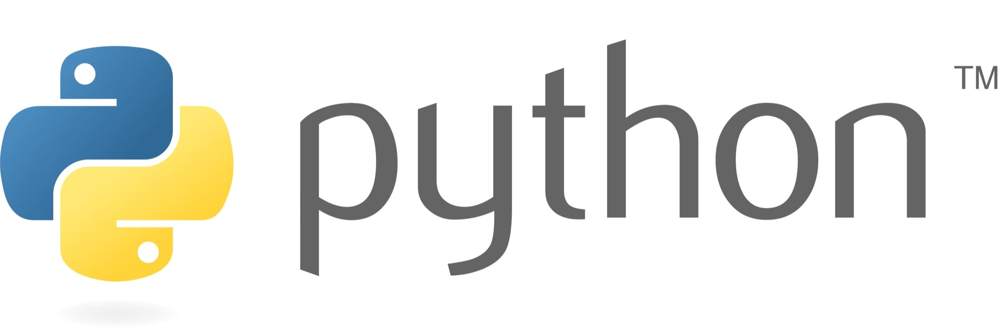
            
            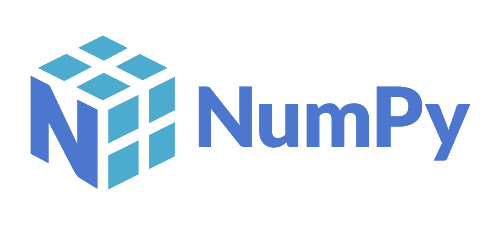        
            
            
          

    

    <!-- Visualisation & BI -->
    

      
<strong>Visualisation & BI</strong>
 
          

            
            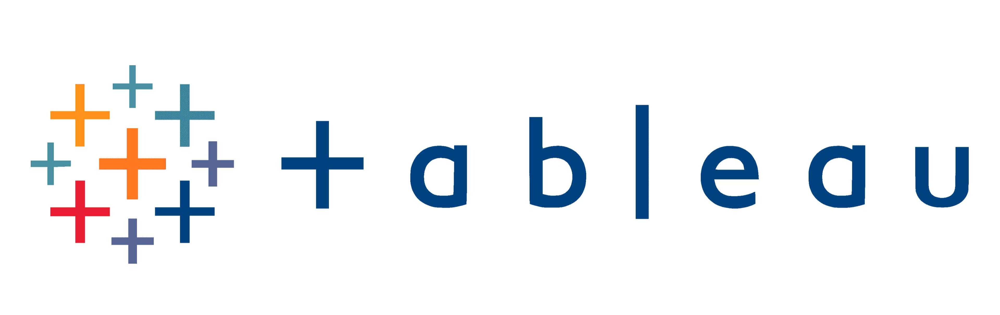
            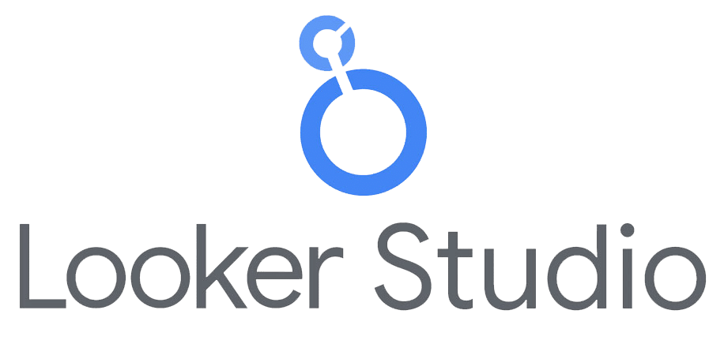     
            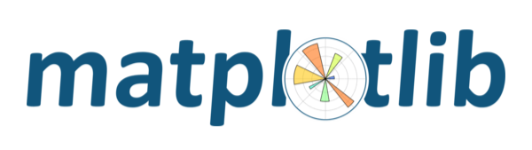
          

    

    <!-- Bases de données & ETL -->
    

      
<strong>Base de données & ETL</strong>
 
          

            
            
            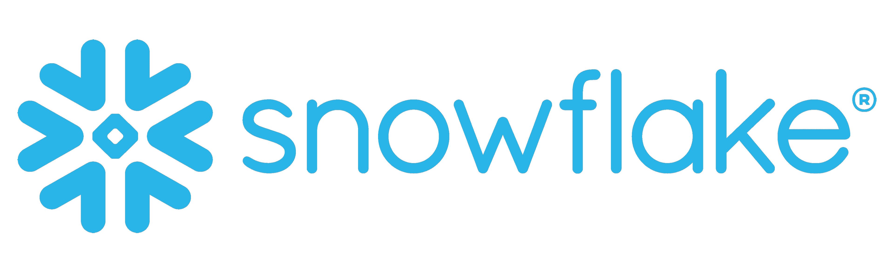     
            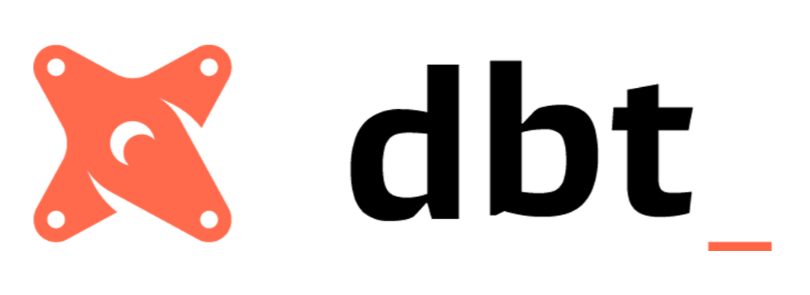
          

    

    <!-- Modélisation & ML -->
    

      
<strong>Modélisation & Machine Learning</strong>
 
          

            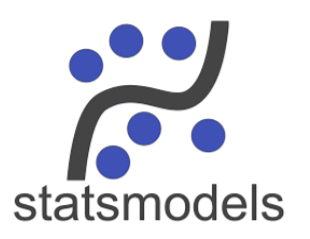
            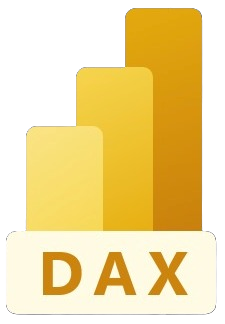
            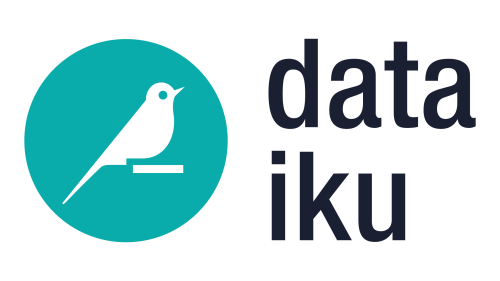            
            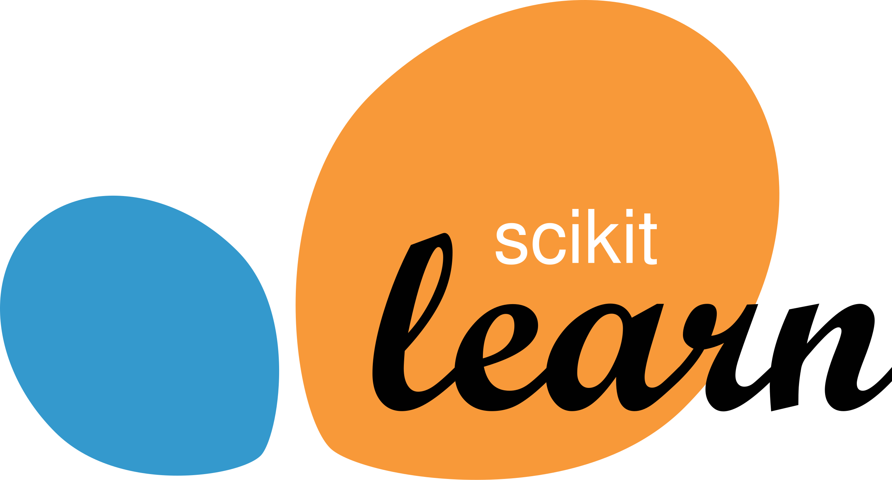
          

    

    <!-- Compétences Métier -->
    <h2 style="text-align: center;">🎯 Compétences Métier</h2>
    

      ✔️<strong>Traduire</strong> des besoins métier en <strong>problématiques data</strong> 
      ✔️ Définir et suivre des <strong>KPI métier</strong> 
      ✔️ Raconter des histoires avec les données – <strong>Storytelling</strong> 
      ✔️ Développer des <strong>solutions Business Intelligence</strong> 
      ✔️ Travailler en <strong>méthode Agile</strong> 
    

    <!-- Soft Skills -->
    <h2 style="text-align: center;">💪 Soft Skills</h2>
    

      📊   Raisonnement analytique 
      🎯   Résolution de problèmes data-driven 
      🔍   Curiosité intellectuelle 
      🧠   Autodidaxie 
      💡   Amélioration continue 
      🗣️   Communication 
      🤝   Collaboration 
      📚   Pédagogie 
      💪   Autonomie 
      🔄   Adaptabilité 
      📏   Rigueur         
    
  
    <!-- Langues -->
    <h2 style="text-align: center;">🌍 Langues</h2>
    
Français : Native 
    Anglais : B2

  

</section>

<!-- CV et haut de page -->

<footer class="text-center mb-1">
  <a href="#top" class="btn-top">↑ Haut de page</a>
</footer>

<!--séparation-->

<!-- Mes projets DATA -->

<section id="projets" class="container mb-3">
  <header class="text-center">
    <h1><strong>🚀 Mes Projets Data</strong></h1>
  </header> 

<!-- Projet 1 Netflix-->

    

      

        <h2 style="margin: 0 0 0.5rem 0; color: #e50914;">
          
          <strong>NETFLIX – Analyse stratégique → → POWER BI & DAX – ONLYOFFICE</strong>
        </h2> 
        

          Création d'un <strong>dashboard interactif Power BI</strong> pour analyser la stratégie de contenu chez Netflix, incluant des mesures <strong>DAX</strong> avancées sur un modèle de données (star schema) préparé avec <strong>Power Query</strong>.
        

        

        

          <em><strong>Objectif métier :</strong> Décrypter la stratégie du géant du streaming pour créer l'engagement addictif de ses abonnés.</em>
        

        

        <!-- Capacités centrées -->
        

          
          
        
        
        

          Power Query
          Data Modeling
          Dashboard
          Visualisation
          Analyse exploratoire EDA
        

        

        <!-- Bouton centré -->
        

          <a href="https://github.com/Elo3534/NETFLIX_PowerBI_DAX_OnlyOffice" target="_blank" class="nav-btn">
            👨‍💻 Voir le projet sur GitHub
          </a>
        

      

    

  

<!-- Projet 2 Aircraft-->

    

      

        <h2 style="margin: 0 0 0.5rem 0; color: #4b75ffdb;">
          
          <strong>AIRCRAFT – Infrastructure des données et analyse → → SQL – Snowflake – DBT – Deepnote</strong></h2> 
        

          <strong>Construction de l'infrastructure des données et analyses pour le secteur aérien, intérêt pour l'efficacité opérationnelle de la flotte, la charge des aéroports et la performance financière des compagnies aériennes.</strong>
        

        

        

          <em><strong>Objectif métier :</strong> Évaluer les ressources opérationnelles (flotte, aéroports) et identifier des leviers de croissance afin d'améliorer les performances des aéroports et des compagnies aériennes à l'étude.</em>
        

        

        <!-- Capacités centrées -->
        

          
          
          
          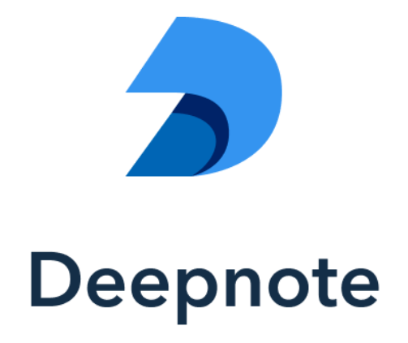
        
  
        

          Data Engineering
          Schéma en étoile
          Documentation
          Analyse exploratoire EDA
          Analyse descriptive
        

        

        <!-- Bouton centré -->
        

          <a href="https://github.com/Elo3534/Aircraft_DBT_SNOWFLAKE" target="_blank" class="nav-btn">
            👨‍💻 Voir le projet sur GitHub
          </a>
        

      

    

  

<!-- Projet 3 Tinder-->

    

      

        <h2 style="margin: 0 0 0.5rem 0; color: #FF4B91;">
          
          <strong>TINDER – Analyse inférentielle → → Python – Pandas – NumPy – Statsmodels – SciPy – Matplotlib – Seaborn – Plotly – SciKit-Learn</strong>
        </h2> 
        

          <strong>Analyse descriptive et inférentielle sur les critères de sélection lors de speed-dating expérimentaux.</strong>
        

        

        

          <em><strong>Objectif métier :</strong> Optimiser la stratégie de matching en identifiant les critères de sélection réels, au-delà des déclarations, pour améliorer la pertinence des recommandations proposées par l'application et ainsi l'engagement des abonnés.</em>
        

        

        <!-- Capacités centrées -->
        

          
          
          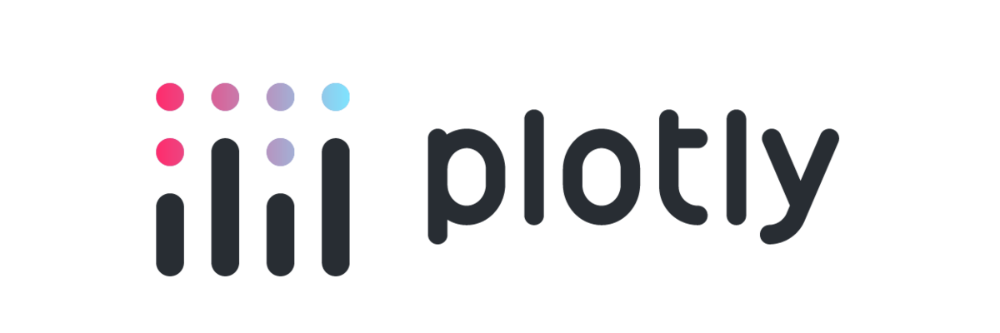          
          
          
           
          
          
        

        

          Analyse exploratoire EDA
          Analyse descriptive
          Analyse inférentielle
        

        

        <!-- Bouton centré -->
        

          <a href="https://github.com/Elo3534/TINDER_python" target="_blank" class="nav-btn">
            👨‍💻 Voir le projet sur GitHub
          </a>
        

      

    

  

<!-- Projet 4 IBM-->

    

      

        <h2 style="margin: 0 0 0.5rem 0; color: #4DA3FF;">
          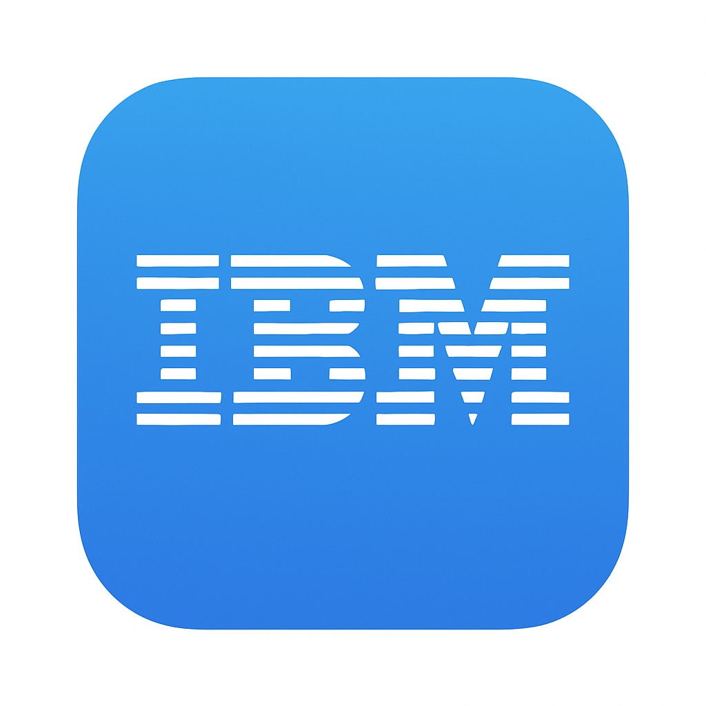
          <strong>ATTRITION CHEZ IBM – Analyse prédictive → → Tableau & Python – Microsoft Power Point – Word</strong>
        </h2> 
        

          <strong>Identification des drivers d'attrition</strong> chez IBM grâce au <strong>feature engineering</strong>,
          à l'analyse exploratoire (<strong>EDA</strong>) et à la modélisation prédictive (<strong>Machine Learning</strong>).
        

        

        

          <em><strong>Objectif métier :</strong> Déterminer les facteurs-clés influençant le turnover et fournir
          des insights actionnables pour anticiper la rétention des talents.</em>
        

        

        <!-- Capacités centrées -->
        

          
          
                     
                           
          
           
          
          
        

        

          Machine Learning
          Feature Engineering
          Analyse Prédictive
          Analyse exploratoire EDA
          Microsoft Office
        

        

        <!-- Bouton centré -->
        

          <a href="https://github.com/Elo3534/Attrition-IBM_Tableau_Python_Word" target="_blank" class="nav-btn">
            👨‍💻 Voir le projet sur GitHub
          </a>
        

      

    

  

</section>

<!-- CV et haut de page -->

<footer class="text-center mb-1">
  <a href="/assets/CV/CV_Elodie_HEINRY_DataAnalyst.pdf" target="_blank" class="btn-cv">
    📄 Téléchargez mon CV
  </a> 

  <a href="#top" class="btn-top">↑ Haut de page</a>

</footer>

<!--séparation-->

<!-- Mes formations et certifications -->

<section id="formations" class="container mb-3">
  <header class="text-center">
    <h1><strong>🎓 Formations</strong></h1>
  </header> 

    <!-- CDSD -->
    

      
2024 2025

      

        <strong>CONCEPTION ET DÉVELOPPEMENT EN SCIENCES DE DONNÉES (CDSD)</strong> - BAC +4 
        - Direction de projets de gestion de données 
        - Analyse exploratoire, descriptive et inférentielle de données
      

      
Montpellier

    

    <!-- LICENCE PRO -->
    

      
2009 2010

      

        <strong>LICENCE PROFESSIONNELLE Biologie Analytique et Expérimentale</strong> - BAC +3
      

      
Angers

    

    <!-- DUT -->
    

      
2007 2009

      

        <strong>DUT GENIE BIOLOGIQUE en Analyses Biologiques et Biochimiques</strong> - BAC +2
      

      
Clermont-Ferrand

    

    <!-- FAC -->
    

      
2007

      
<strong>LICENCE Biologie Première Année</strong> 
        Année validée
      

      
Rennes

    

    <!-- DAEU -->
    

      
2006

      
<strong>DAEU B</strong> - équivalent BAC

      
Rennes

    

  

</section> 

<!-- CV et haut de page -->

<footer class="text-center mb-1">
  <a href="#top" class="btn-top">↑ Haut de page</a>
</footer>

<!--séparation-->

<!-- Mes expériences professionnelles -->

<section id="experiences" class="container mb-3" style="text-align: center;">
  <header class="text-center">
    <h1><strong>🤝 Expériences Professionnelles</strong></h1>
  </header> 

        <h3 style="color: #2c3e50; margin: 0 0 0.5rem 0; font-weight: bold;">agent de maîtrise – Lycée privé, Aix-en-Provence – 2017 à 2024
        </h3>
          <ul style="color: #384f66ff; line-height: 1.6; margin: 0 0 1rem 1.5rem; padding-left: 3rem;">
            <li>Référencement produits chimiques et sécurité laboratoire</li>
            <li>Intégration d'un outil informatisé</li>
            <li>Préparation et mise au point de TP et protocoles expérimentaux</li>
          </ul>
          
        <h3 style="color: #2c3e50; margin: 0 0 0.5rem 0; font-weight: bold;">ingénieure d'étude en cytogénétique – INRA, Angers – 2010 à 2013
        </h3>
          

            <em style="padding-left: 3rem;">Analyse cytogénétique de 8 genres de plantes ornementales pour un projet partenarial.</em>

          <ul style="color: #384f66ff; line-height: 1.6; margin: 0 0 1rem 1.5rem; padding-left: 3rem;">
            <li>Protocoles expérimentaux, <strong>analyses statistiques, reporting visuel</strong></li>
            <li>Organisation laboratoire, gestion stocks et budgets</li>
            <li><strong>Collaboration pluridisciplinaire et Visualisations</strong></li>
          </ul>
          
        <h3 style="color: #2c3e50; margin: 0 0 0.5rem 0; font-weight: bold;">conductrice de lignes – Ipsen, Thalès, Oberthur, ...  – 2002 à 2007 et 2014 à 2017
        </h3>
          <ul style="color: #384f66ff; line-height: 1.6; margin: 0 0 1rem 1.5rem; padding-left: 1.5rem;">
            <li>Conduite de lignes automatisées</li>
            <li>Contrôle qualité</li>
            <li>Polyvalence secteur divers</li>
          </ul>
  

</section>

<!-- CV et haut de page -->

<footer class="text-center mb-1">
  <a href="#top" class="btn-top">↑ Haut de page</a>
</footer>

<!--séparation-->

<!-- Mon contact -->

<section id="contact" class="container mb-3">
  <header class="text-center">
    <h1><strong>📫 Contactez-moi</strong></h1>
  </header>

    

      

        📧
        <a href="mailto:heinryelodie@hotmail.fr">heinryelodie@hotmail.fr</a>
      

      

        📞
        06 18 70 42 77
      

      

        💼
        <a href="https://www.linkedin.com/in/elodie-heinry" target="_blank">Mon LinkedIn</a>
      

      

        👨‍💻
        <a href="https://github.com/Elo3534" target="_blank">Mon GitHub</a>
      

      

        🌐
        Montpellier
      

    

  

</section>

<!--séparation-->

<!-- Moi, en plus -->

<header class="text-center">
  <h1><strong>👁️ Vous vouliez en savoir plus ?</strong></h1>
</header>

<article>
  

    🎯 Passionnée par la résolution d’énigmes complexes (<strong>logique + créativité</strong>). 
    🌿 Connectée à la nature et toujours prête à voyager (<strong>énergie, curiosité</strong>). 
    📚 Lectrice assidue d’enquêtes et de journalisme d’investigation (<strong>esprit critique</strong>). 
    👉 En résumé : <strong>100% curieuse</strong>, <strong>0% routine</strong>, et un <strong>grand sourire</strong> face aux défis !
  

</article> 

<!-- haut de page -->

<footer class="text-center mb-1">
  <a href="#top" class="btn-top">↑ Haut de page</a>
</footer>

<!-- Navigation rapide -->

<nav class="text-center mb-2" aria-label="Navigation principale">
  <a href="#apropos" class="nav-btn">À Propos</a>
  <a href="#competences" class="nav-btn">Compétences</a>
  <a href="#projets" class="nav-btn">Projets</a>
  <a href="#formations" class="nav-btn">Formations</a>
  <a href="#experiences" class="nav-btn">Expériences</a>
  <a href="#contact" class="nav-btn">Contact</a>
</nav>

<!-- Icônes de contact -->

<nav class="text-center mt-2">
  
  
  
  
  
</nav>
 
<footer style="text-align:center;">
  © 2025 Élodie HEINRY – Tous droits réservés
</footer>
